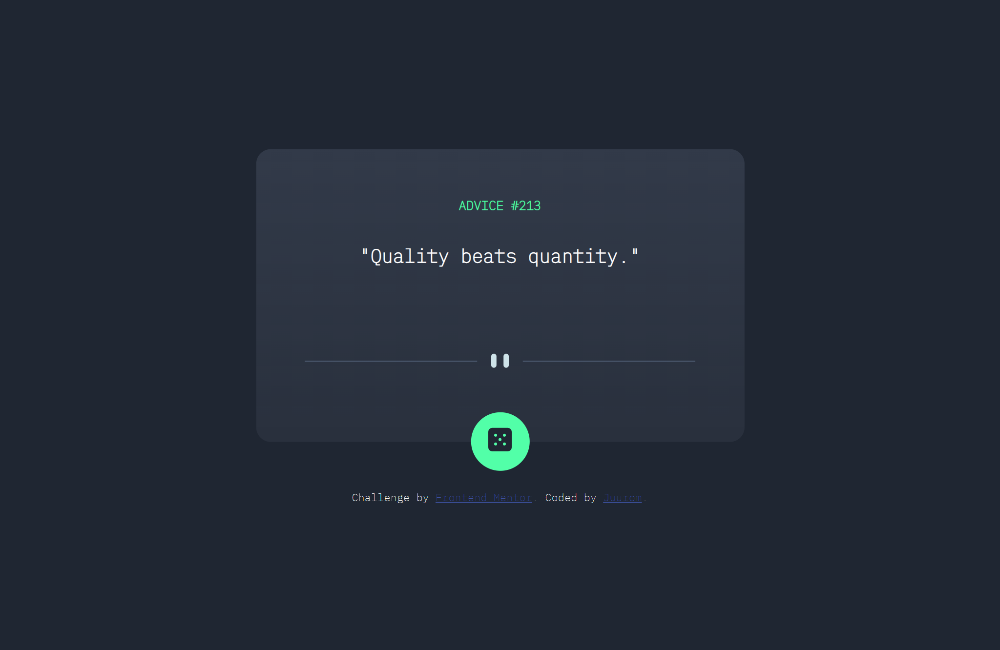
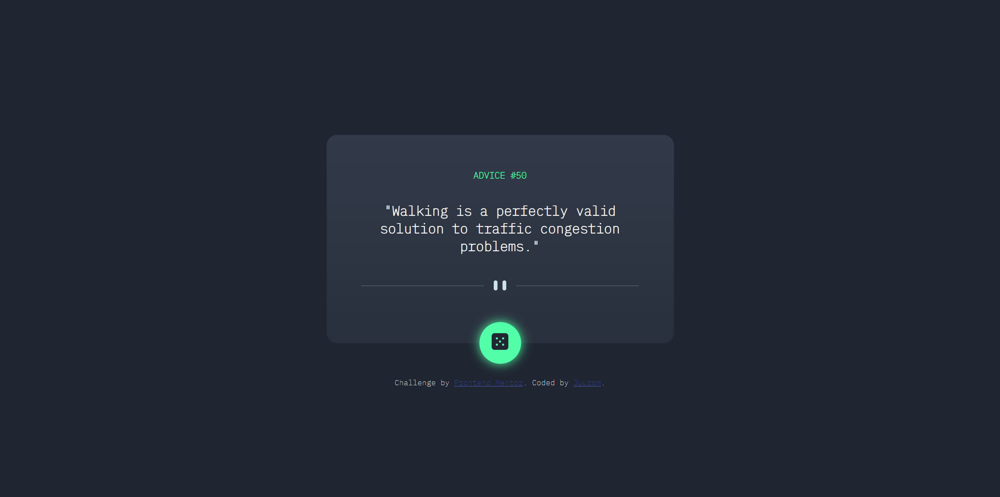
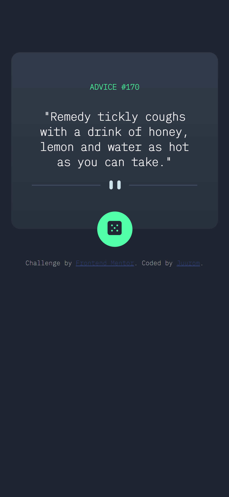

# Frontend Mentor - Advice generator app solution

이 솔루션은 [Advice generator app challenge on Frontend Mentor](https://www.frontendmentor.io/challenges/advice-generator-app-QdUG-13db) 챌린지 참여 결과물입니다.

## 차례

- [소개](#소개)
  - [챌린지](#챌린지)
  - [화면 스크린샷](#화면-스크린샷)
  - [링크](#링크)
- [배운 점](#배운-점)
  - [사용 tool](#사용-tool)
  - [새롭게 배운 것](#새롭게-배운-것)
  - [앞으로 배울 것](#앞으로-배울-것)
  - [참고 사이트](#참고-사이트)
- [제작자](#제작자)
- [기타사항](#기타사항)

## 소개

### 챌린지

adviceslip api를 활용해
버튼 클릭을 할 때마다
새로운 명언을 보여주는 컴포넌트를 제작했다.

### 화면-스크린샷






### 링크

- Solution URL: [Github](https://github.com/juurom/Advice___frontendMentor/)
- Live Site URL: [Live Site](https://juurom.github.io/Advice___frontendMentor/)

## 배운-점

### 사용-tool

- HTML
- CSS
- JAVASCRIPT

### 새롭게-배운-것

api를 fetch() 함수로 호출하는데,
fetch()를 쓰기 위해서는 promise를 알아야 하고
promise를 알기 위해서는 비동기 처리를 알아야 했다.

하나씩 이해해 보자.

1. 비동기 처리

자바스크립트가 데이터를 받는 방식은 동기와 비동기가 있다.
- 동기(synchronus)
요청과 동시에 그 결과가 일어난다. 요청을 하면 그 로직의 시간이 얼마나 걸리든 관계없이 결과가 주어질 때까지 기다려야 한다.
- 비동기(asynchronus)
요청과 동시에 결과가 주어지지 않는다. 결과가 주어지는 시간동안 다른 작업을 할 수 있다.

2. promise

프로미스는 자바스크림트의 비동기 처리에 사용되는 객체로, 서버에서 받아온 데이터를 화면에 표시할 때 사용된다.
프로미스는 다음 세 가지 상태가 있다.

- 대기(pending): 비동기 로직을 처리하는 중
- 이행(fulfilled): 비동기 처리가 완료되어 프로미스 결과값 반환
- 실패(rejected): 비동기 처리 실패 또는 오류

프로미스 상태는
대기 -> 이행 or 실패
순서로 진행된다.

프로미스 상태의 변화 예시 코드는 아래와 같다.

```js
function getData(){
  new Promise(function(resolve, reject)){ /*대기*/
    var data=100;
    resolve(data); /*이행*/
    reject(new Error("error!!!"));/*실패*/
  }
}

getData().then(function(resolvedData)){
  console.log(resolvedData); /*100*/
}
getData().then().catch(function(err){
  console.log(err); /*error!!!*/
})
```

3. fetch() 함수 사용 방법

fetch를 통해 api를 호출하고,
api 내부 객체에 접근하는 방법을 알게 되었다.
사용한 코드는 아래와 같다.

JS
```javascript
advgen();/*새로고침 시 새로운 advice 생성*/

$("#generator").click(function(){/*버튼 클릭 시 새로운 advice 생성*/
    const slip = advgen();
    console.log(slip);
})


function advgen(){/*advice 생성 함수*/
    fetch("https://api.adviceslip.com/advice")
    .then((response) => response.json())
    .then(data => {
        const advarr=Object.values(data.slip);
        console.log(advarr);
        $("#adviceid").text(advarr[0]);
        $("#advicetext").text(advarr[1]);
    })
    .catch(error=>{
        $("#adviceid").text("???");
        $("#advicetext").text("Something wrong with generating advice! :(");
    })
}
```

advgen() 함수를 한 줄씩 살펴보자.

(1) api 접근
```javascript
fetch("https://api.adviceslip.com/advice")
```
fetch()를 통해 api에 접근한다.
fetch()는 기본적으로 이하 문법을 따른다.

fetch("url")
.then(res=>response.json())
.then(res=>{/*something to do with res*/});

fetch()는 promise를 반환하며,
promise가 fulfilled되면 이하의 첫 번째 then을 실행한다.
그 다음, 두 번째 then에서 json 데이터로 로직을 실행한다.

)


(2) response body를 json 데이터로 파싱
```javascript
.then((response) => response.json())
```

json 형식은 경량의 데이터를 주고받기 위해 사용되며
key-value 형태로 저장된다.

*ex: 
jsonObject{
  key1: val1,
  key2: val2
}

위 코드에서, response를 console에 출력해보면,
body는 ReadableString으로 보이며
이 상태로는 response body에 접근할 수 없다.

console.log(response) 결과의 body는 다음과 같다.


따라서 response body를 json 데이터로 바꾸어
접근 가능한 형식으로 만들어야 한다.

console.log(response.json()) 결과에서 사용해야 할 데이터는 다음과 같다.


(3)-1. api 응답 성공 시 (promise 이행)
```javascript
.then(data => {
    const advarr=Object.values(data.slip);
    console.log(advarr);/*{123, "some advice sentence"}*/
    $("#adviceid").text(advarr[0]); /*slip의 첫 번째 value(123)*/
    $("#advicetext").text(advarr[1]);/*slip의 두 번째 advice의 value(some advice sentence))*/
})
```

두 번째 .then에서 json data 안의 slip 객체에 접근해서, span 내부에 출력한다.
slip 객체 내부에 들어 있는 id와 advice를 배열로 받아서
index를 통해 접근하였다.

(3)-2. api 응답 실패 시 (promise 실패)
```javascript
.catch(error=>{ 
    $("#adviceid").text("???");
    $("#advicetext").text("Something wrong with generating advice! :(");
})
```
api 주소가 잘못되었거나 기타 이유로 api response를 받지 못했을 때,
.catch를 통해 에러 메시지를 출력한다.

### 앞으로-배울-것

api를 활용할 수 있게 됐지만
사실 프로미스 개념에 대해서 완벽하게 이해하지는 못했다. ㅠㅠ
프로미스가 언제 어떻게 쓰이는지 많은 페이지를 만들어보면서 체득해야겠다.

### 참고-사이트

- [fetch 사용법](https://yeri-kim.github.io/posts/fetch/) - fetch 함수를 사용하는 방법이다.
- [js promise](https://joshua1988.github.io/web-development/javascript/promise-for-beginners/) - promise 개념 정리이다.
- [js 비동기 처리](https://joshua1988.github.io/web-development/javascript/javascript-asynchronous-operation/) - 비동기 처리 개념 정리이다.
- [상태관리](https://medium.com/wematch/%ED%94%84%EB%A1%A0%ED%8A%B8%EC%97%94%EB%93%9C%EC%9D%98-%EC%83%81%ED%83%9C%EA%B4%80%EB%A6%AC%EB%9E%80-%EB%AC%B4%EC%97%87%EC%9D%B8%EA%B0%80-5ff888dab7ad) - 구글링하다가 상태관리라는 말이 있어서 이게 뭐지? 했는데 정리가 너무 잘 돼 있어서 가져왔다. 비동기/동기 처리를 통해서 상태관리를 하는 것 같다.

## 제작자

- Github - [@juurom](https://github.com/juurom/)
- Frontend Mentor - [@yourusername](https://www.frontendmentor.io/profile/juurom)

## 기타사항
컴포넌트 만드는 것보다 정리하는 게 더 오래 걸렸다.
코드 보고 대충 변수만 맞게 끼워넣으면 돌아가긴 하는데
왜 돌아가는지 이해하고 정리하는 게 더 어렵구나...하는 걸 몸소 느꼈다.

무작정 결과물만 만들지 말고,
그 결과물로부터 배운 점들을 흡수하고 넘어가는 게
정말정말 중요한 것 같다.
